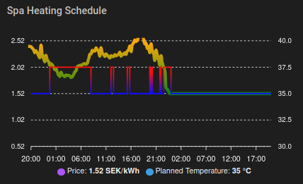

<p align="center">
</p>

A Home Assistant custom integration that intelligently controls spa/hot tub heating based on electricity prices. It treats your spa water as a thermal battery — heating more when electricity is cheap and coasting when it's expensive — using a continuous price-to-temperature mapping.

<a href="https://www.buymeacoffee.com/zteifel" target="_blank"></a>

## Table of Contents

- [Features](#features)
- [Dependencies](#dependencies)
- [Algorithm](#algorithm)
- [Settings](#settings)
- [Installation](#installation)
- [ApexCharts Configuration](#apexcharts-configuration)
- [Entities Created](#entities-created)
- [License](#license)

## Features

- **Price-proportional heating** — continuously maps electricity prices to target temperatures
- **Pre-heat boost** — looks ahead to detect upcoming expensive periods and stores extra heat in advance
- **Configurable price window** — choose between global or rolling window for price range calculation
- **15-minute granularity** — works with both hourly and 15-minute price data
- **Manual override detection** — respects manual temperature changes
- **Force controls** — manually trigger max/min temperature when needed

## Dependencies

This integration requires two entities to be configured in Home Assistant:

### Electricity Price Entity

An entity that provides electricity prices with `today` and `tomorrow` attributes containing price lists.

**Supported integrations:**
- [Nordpool](https://github.com/custom-components/nordpool) - Provides 96 values per day (15-minute intervals)
- Other price integrations with similar data structure

### Climate Entity

A climate entity that controls your spa/hot tub heating. The integration controls the spa by setting the target temperature, which varies continuously between a configured min and max based on electricity prices.

## Algorithm

The price proportional algorithm maps electricity prices to target temperatures continuously:

1. **Build price slots** from today's and tomorrow's price data (supports 15-minute and hourly intervals).

2. **Determine price range** — either globally across all available data, or using a rolling window of configurable hours centered on each slot.

3. **Map price to temperature** for each slot:
   - Cheapest price → **Max Temperature** (store heat)
   - Most expensive price → **Min Temperature** (coast)
   - Prices in between are mapped linearly

4. **Lookahead boost** — for each slot, compute the average price of the next N hours. If upcoming prices are significantly higher than the current price, boost the target temperature to pre-heat before the expensive period. The boost can add up to 50% of the remaining headroom to max temperature.

5. **Round and merge** — target temperatures are rounded to the nearest 0.5°C (matching typical spa hardware precision), then consecutive slots with the same temperature are merged to reduce service calls.

This ensures:
- Maximum heat storage during cheap periods
- Minimal heating during expensive periods
- Smooth pre-heating transitions before price spikes

## Settings

All settings can be adjusted in real-time through Home Assistant number entities.

| Setting | Range | Default | Description |
|---------|-------|---------|-------------|
| **Max Temperature** | 20–42°C | 40 | Target temperature during the cheapest electricity prices. |
| **Min Temperature** | 5–42°C | 34 | Target temperature during the most expensive electricity prices. |
| **Lookahead Hours** | 1–12 hours | 3 | How far ahead to look for upcoming expensive prices. Triggers pre-heating when future prices are higher than current. |
| **Price Window Hours** | 0–48 hours | 0 | Rolling window for calculating the price min/max range. `0` uses all available price data (global). A smaller window makes the temperature more responsive to local price variations. |
| **Manual Override Duration** | 1–12 hours | 3 | How long to respect manual temperature changes before resuming automatic control. |

## Installation

### HACS (Recommended)

1. Open **HACS** in Home Assistant
2. Click the **3 dots** menu (top right) → **Custom repositories**
3. Add the repository:
   - **Repository:** `https://github.com/zteifel/smart-spa-heating`
   - **Category:** `Integration`
   - Click **Add**
4. Search for "Smart Spa Heating" in HACS and click **Download**
5. **Restart Home Assistant**
6. Go to **Settings → Devices & Services → Add Integration**
7. Search for "Smart Spa Heating" and configure with your Nordpool and climate entities

### Manual

1. Download or clone this repository
2. Copy the `smart_spa_heating` folder to your `config/custom_components` directory
3. Restart Home Assistant
4. Go to **Settings → Devices & Services → Add Integration**
5. Search for "Smart Spa Heating" and configure

## ApexCharts Configuration

You can visualize the heating schedule using [ApexCharts Card](https://github.com/RomRider/apexcharts-card).

The integration provides a `sensor.smart_spa_heating_planned_temperature` entity with a `data` attribute containing timestamp/temperature pairs for graphing.



### Example Card Configuration

```yaml
type: custom:apexcharts-card
header:
  show: true
  title: Spa Heating Schedule
graph_span: 48h
span:
  start: minute
now:
  show: false
  label: Now
yaxis:
  - id: price
    opposite: false
    decimals: 2
    apex_config:
      forceNiceScale: true
  - id: temp
    opposite: true
    min: 30
    max: 42
    align_to: 100
    apex_config:
      tickAmount: 4
series:
  - entity: sensor.nordpool_kwh_se3_sek_3_10_025
    type: line
    yaxis_id: price
    name: Price
    float_precision: 2
    color_threshold:
      - value: -1
        color: cyan
      - value: 1.5
        color: green
      - value: 2.5
        color: orange
      - value: 3.5
        color: red
      - value: 5
        color: black
    data_generator: >
      let td = entity.attributes.raw_today; let tm =
      entity.attributes.raw_tomorrow; const repeatLast = (x) => [new
      Date(x.at(-1)[0]).getTime()+3600000, x.at(-1)[1]]; let dataset = [
        ...td.map((data, index) => {
          return [data["start"], data["value"]];
        }),
        ...tm.map((data, index) => {
          return [data["start"], data["value"]];
        })
      ]; return [...dataset, repeatLast(dataset)];
  - entity: sensor.smart_spa_heating_planned_temperature
    yaxis_id: temp
    data_generator: |
      return entity.attributes.data;
    curve: stepline
    stroke_width: 2
    color_threshold:
      - value: -2
        color: white
      - value: 34
        color: blue
      - value: 37
        color: orange
      - value: 40
        color: red
    name: Planned Temperature
apex_config:
  chart:
    height: 250
  xaxis:
    type: datetime
    labels:
      datetimeFormatter:
        hour: HH:mm
experimental:
  color_threshold: true
```

**Note:** Replace `sensor.nordpool_kwh_se3_sek_3_10_025` with your actual Nordpool sensor entity ID.

### Simpler Configuration (Temperature Only)

```yaml
type: custom:apexcharts-card
header:
  show: true
  title: Spa Temperature Plan
graph_span: 24h
series:
  - entity: sensor.smart_spa_heating_planned_temperature
    name: Planned Temperature
    type: line
    stroke_width: 2
    curve: stepline
    data_generator: |
      return entity.attributes.data || [];
```

## Entities Created

### Sensors

| Entity | Description |
|--------|-------------|
| `sensor.smart_spa_heating_next_heating` | Next scheduled temperature change |
| `sensor.smart_spa_heating_heating_schedule` | Full schedule with all slots and target temperatures |
| `sensor.smart_spa_heating_current_price` | Current electricity price |
| `sensor.smart_spa_heating_planned_temperature` | Current planned temperature with timeline data for ApexCharts |
| `sensor.smart_spa_heating_manual_override_remaining` | Time remaining in manual override |

### Binary Sensors

| Entity | Description |
|--------|-------------|
| `binary_sensor.smart_spa_heating_heating_active` | Whether heating is currently active (temperature above min) |
| `binary_sensor.smart_spa_heating_manual_override_active` | Whether manual override is active |

### Controls

| Entity | Type | Description |
|--------|------|-------------|
| `switch.smart_spa_heating_smart_heating` | Switch | Master on/off for automatic heating |
| `button.smart_spa_heating_force_heat_on` | Button | Force max temperature immediately |
| `button.smart_spa_heating_force_heat_off` | Button | Force min temperature immediately |
| `button.smart_spa_heating_clear_manual_override` | Button | Clear manual override early |

### Settings (Number Entities)

| Entity | Description |
|--------|-------------|
| `number.smart_spa_heating_max_temperature` | Max temperature during cheap prices (°C) |
| `number.smart_spa_heating_min_temperature` | Min temperature during expensive prices (°C) |
| `number.smart_spa_heating_lookahead_hours` | Hours to look ahead for pre-heat boost |
| `number.smart_spa_heating_price_window_hours` | Rolling window for price range (0 = all prices) |
| `number.smart_spa_heating_manual_override_duration` | Manual override duration (hours) |

## License

MIT License
